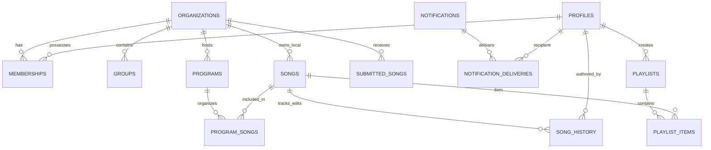

# 🐘 RehearsalHub — Complete Database Architecture, Schema & State Audit Report

> **Target Audience**: Data Engineers, Backend Engineers, System Administrators, Leadership  
> **Environment**: PostgreSQL 16 (Hosted on Railway) via Prisma ORM (`rehearsalhub-api`)  
> **Database Architecture**: 3NF Pure Relational Multi-Tenant Model with Global Master Repertoire Layer  
> **Audit Status**: ✅ Verified & Cleaned (Zero Orphaned Records, 100% Referential Integrity, 29 Live Tables)

---

## 📑 Table of Contents
1. [Executive Summary & Global Architecture](#1-executive-summary--global-architecture)
2. [Complete 29-Table Master Registry](#2-complete-29-table-master-registry)
3. [Global Master Layer (Unguarded / Ministry Catalog)](#3-global-master-layer-unguarded--ministry-catalog)
4. [Zone-by-Zone Ecosystem Matrix](#4-zone-by-zone-ecosystem-matrix)
5. [Comprehensive Schema & Column Definitions (All 29 Tables)](#5-comprehensive-schema--column-definitions-all-29-tables)
6. [Song & Repertoire Breakdown](#6-song--repertoire-breakdown)
7. [Program & Rehearsal Breakdown](#7-program--rehearsal-breakdown)
8. [Media, Playlists & Communication Assets](#8-media-playlists--communication-assets)
9. [Foreign Key Constraints & Cascade Policy Matrix](#9-foreign-key-constraints--cascade-policy-matrix)
10. [Zero-Orphan Mathematical Verification](#10-zero-orphan-mathematical-verification)
11. [Database Cleanup & Structuring Changelog](#11-database-cleanup--structuring-changelog)
12. [Data Engineering & Operational Recommendations](#12-data-engineering--operational-recommendations)

---

## 1. Executive Summary & Global Architecture

RehearsalHub operates on a **hybrid multi-tenant architecture**:
1. **Global Public Layer**: Open and unguarded by zone. Contains the canonical ministry repertoire (**827 Master Songs** and **46 Master Programs**) that all zones rehearse against.
2. **Zonal Tenancy Layer**: Scoped by `organization_id` (e.g. `zone-001` for Loveworld Singers HQ, `zone-052` for Lagos Sub Zone C, `zone-088` for Special Duty Zone).
3. **Subgroup / Church Choir Layer**: Scoped by `group_id` under each organization for localized unit or church choir rehearsals (`groups` table kept clean at 0 rows ready for activation).



---

## 2. Complete 29-Table Master Registry

Every table currently residing in the PostgreSQL `public` schema:

| # | Table Name | Prisma Model | Domain | Live Rows | Columns | Foreign Keys | Status |
| :-: | :--- | :--- | :--- | :---: | :---: | :---: | :---: |
| 1 | **`attendance`** | `Attendance` | Rehearsals & Events | **2,105** | 11 | 4 | ✅ Verified |
| 2 | **`auth_credentials`** | `AuthCredential` | Authentication | **4** | 4 | 1 | ✅ Verified |
| 3 | **`calls`** | `Call` | WebRTC Comms | **19** | 11 | 0 | ✅ Verified |
| 4 | **`categories`** | `Category` | Taxonomy | **123** | 6 | 1 | ✅ Verified |
| 5 | **`chat_participants`** | `ChatParticipant` | Comms & Messaging | **945** | 4 | 2 | ✅ Verified |
| 6 | **`chats`** | `Chat` | Comms & Messaging | **132** | 6 | 2 | ✅ Verified |
| 7 | **`groups`** | `Group` | Tenancy (Subgroups) | **0** | 9 | 1 | 🧹 Clean |
| 8 | **`media_assets`** | `MediaAsset` | Media & Storage | **7,823** | 12 | 2 | ✅ Verified |
| 9 | **`media_doodles`** | `MediaDoodle` | Rehearsal Annotations | **0** | 6 | 2 | 🆕 Ready |
| 10 | **`memberships`** | `Membership` | Tenancy & Roles | **1,002** | 9 | 3 | ✅ Verified |
| 11 | **`messages`** | `Message` | Comms & Messaging | **891** | 8 | 2 | ✅ Verified |
| 12 | **`notification_deliveries`** | `NotificationDelivery` | Notifications | **0** | 5 | 2 | 🆕 Ready |
| 13 | **`notifications`** | `Notification` | Notifications | **30** | 10 | 2 | ✅ Verified |
| 14 | **`organizations`** | `Organization` | Tenancy (Workspaces) | **86** | 10 | 0 | ✅ Verified |
| 15 | **`playlist_items`** | `PlaylistItem` | Playlists | **1,099** | 4 | 2 | ✅ Verified |
| 16 | **`playlists`** | `Playlist` | Playlists | **304** | 7 | 2 | ✅ Verified |
| 17 | **`profiles`** | `User` | User Identity | **880** | 10 | 0 | ✅ Verified |
| 18 | **`program_songs`** | `ProgramSong` | Rehearsal Programs | **3,817** | 4 | 2 | ✅ Verified |
| 19 | **`programs`** | `Program` | Rehearsal Programs | **127** | 14 | 2 | ✅ Cleaned |
| 20 | **`refresh_tokens`** | `RefreshToken` | Authentication | **173** | 5 | 1 | ✅ Verified |
| 21 | **`settings`** | `Setting` | System Config | **23** | 5 | 0 | ✅ Verified |
| 22 | **`song_categories`** | `SongCategory` | Taxonomy Junction | **0** | 2 | 2 | 🆕 Ready |
| 23 | **`song_history`** | `SongHistory` | Repertoire History | **591** | 8 | 2 | 🆕 Populated |
| 24 | **`song_role_assignments`** | `SongRoleAssignment` | Roles & Roster | **4** | 4 | 2 | ✅ Verified |
| 25 | **`songs`** | `Song` | Song Repertoire | **3,732** | 25 | 2 | ✅ Cleaned |
| 26 | **`submitted_songs`** | `SubmittedSong` | Singer Submissions | **202** | 10 | 0 | ✅ Cleaned |
| 27 | **`support_tickets`** | `SupportTicket` | Help Desk | **0** | 10 | 2 | 🆕 Ready |
| 28 | **`user_song_notes`** | `UserSongNote` | Singer Notes | **0** | 6 | 2 | 🆕 Ready |
| 29 | **`user_statuses`** | `UserStatus` | Social Status Stories | **0** | 9 | 1 | 🆕 Ready |

---

## 3. Global Master Layer (Unguarded / Ministry Catalog)

The Global Master catalog represents the central ministry repertoire referenced across all churches and zones worldwide.

| Entity | Total Count | Classification | Access Control | Details |
| :--- | :---: | :--- | :--- | :--- |
| **Master Songs** | **827** | `is_master = true`, `organization_id = NULL` | Public / Global | • **822** Ministered Songs (`is_ministered = true`)<br>• **5** Unministered Songs (`is_ministered = false`) |
| **Master Programs** | **46** | `category = 'ministered'`, `status = 'published'` | Public / Global | Canonical ministry Praise Nights and Services hosted by Pastor Chris |

### The 46 Canonical Master Programs

| # | Program Name | Songs Attached | Category | Status |
| :-: | :--- | :---: | :--- | :--- |
| 1–28 | **Praise Night 1** through **Praise Night 28** | ~1,100 | `ministered` | `published` |
| 29–33 | **Healing Streams Live Healing Services (HSLHS) March** (2022, 2023, 2024, 2025, 2026) | ~115 | `ministered` | `published` |
| 34–38 | **HSLHS July** (2022, 2023, 2024, 2025, 2026) | ~80 | `ministered` | `published` |
| 39–41 | **HSLHS October** (2023, 2024, 2025) | ~45 | `ministered` | `published` |
| 42 | **HSLHS November 2022** | 12 | `ministered` | `published` |
| 43–45 | **Christmas Eve Services** (2023, 2024, 2025) | ~35 | `ministered` | `published` |
| 46 | **10,000 Man Choir / All Praise Service** | 18 | `ministered` | `published` |

---

## 4. Zone-by-Zone Ecosystem Matrix (All 86 Organizations)

Complete live data breakdown across every single registered organization in the database:

| Zone ID | Organization Name | Zone Code | Is HQ? | Members | Admins | Programs | Local Songs | Submissions | Attendance |
| :--- | :--- | :--- | :---: | :---: | :---: | :---: | :---: | :---: | :---: |
| `zone-001` | **Loveworld Singers HQ** | `your-loveworld-singers` | Yes | **874** | 0 | **124** | **2785** | **200** | **2097** |
| `zone-009` | **Loveworld Singers SA Zone 5** | `lws-sa-zone-5` | No | **88** | 0 | **0** | **20** | **0** | **0** |
| `zone-052` | **Loveworld Singers Lagos Sub Zone C** | `lws-lagos-szc` | No | **21** | 0 | **2** | **41** | **0** | **0** |
| `zone-088` | **Special Duty Zone** | `special-duty-zone` | No | **12** | 0 | **1** | **57** | **1** | **0** |
| `zone-044` | **Loveworld Singers Lagos Zone 1** | `lws-lagos-z1` | No | **2** | 0 | **0** | **0** | **0** | **0** |
| `zone-017` | **Loveworld Singers USA Region 1 Zone 2** | `lws-usa-r1-z2` | No | **1** | 0 | **0** | **1** | **0** | **0** |
| `zone-048` | **Loveworld Singers Lagos Zone 5** | `lws-lagos-z5` | No | **1** | 0 | **0** | **1** | **1** | **0** |
| `zone-038` | **Loveworld Singers South America NZ Pacific** | `lws-sa-pacific` | No | **1** | 0 | **0** | **0** | **0** | **0** |
| `zone-045` | **Loveworld Singers Lagos Zone 2** | `ZONE045` | No | **1** | 0 | **0** | **0** | **0** | **0** |
| `zone-086` | **Loveworld Singers CELVZ** | `lws-celvz` | No | **1** | 0 | **0** | **0** | **0** | **0** |
| `zone-006` | **Loveworld Singers SA Zone 1** | `ZONE006` | No | **0** | 0 | **0** | **0** | **0** | **0** |
| `zone-007` | **Loveworld Singers SA Zone 2** | `lws-sa-zone-2` | No | **0** | 0 | **0** | **0** | **0** | **0** |
| `zone-008` | **Loveworld Singers SA Zone 3** | `ZONE008` | No | **0** | 0 | **0** | **0** | **0** | **0** |
| `zone-010` | **Loveworld Singers Durban Zone** | `ZONE010` | No | **0** | 0 | **0** | **0** | **0** | **0** |
| `zone-011` | **Loveworld Singers Cape Town Zone 1** | `ZONE011` | No | **0** | 0 | **0** | **0** | **0** | **0** |
| `zone-012` | **Loveworld Singers Cape Town Zone 2** | `ZONE012` | No | **0** | 0 | **0** | **0** | **0** | **0** |
| `zone-013` | **Loveworld Singers India Zone** | `lws-india` | No | **0** | 0 | **0** | **0** | **0** | **8** |
| `zone-014` | **Loveworld Singers Kenya Zone** | `ZONE014` | No | **0** | 0 | **0** | **0** | **0** | **0** |
| `zone-015` | **Loveworld Singers Accra Ghana Zone** | `ZONE015` | No | **0** | 0 | **0** | **0** | **0** | **0** |
| `zone-016` | **Loveworld Singers USA Region 1 Zone 1** | `ZONE016` | No | **0** | 0 | **0** | **0** | **0** | **0** |
| `zone-018` | **Loveworld Singers USA Region 2** | `ZONE018` | No | **0** | 0 | **0** | **0** | **0** | **0** |
| `zone-019` | **Loveworld Singers USA Region 3** | `ZONE019` | No | **0** | 0 | **0** | **0** | **0** | **0** |
| `zone-020` | **Loveworld Singers Ottawa Zone Canada** | `ZONE020` | No | **0** | 0 | **0** | **0** | **0** | **0** |
| `zone-021` | **Loveworld Singers Toronto Canada Zone** | `ZONE021` | No | **0** | 0 | **0** | **0** | **0** | **0** |
| `zone-022` | **Loveworld Singers Quebec Zone** | `ZONE022` | No | **0** | 0 | **0** | **0** | **0** | **0** |
| `zone-023` | **Loveworld Singers UK Zone 1 DSP** | `ZONE023` | No | **0** | 0 | **0** | **0** | **0** | **0** |
| `zone-024` | **Loveworld Singers UK Zone 2 DSP** | `ZONE024` | No | **0** | 0 | **0** | **0** | **0** | **0** |
| `zone-025` | **Loveworld Singers UK Zone 3 DSP** | `ZONE025` | No | **0** | 0 | **0** | **0** | **0** | **0** |
| `zone-026` | **Loveworld Singers UK Zone 4 DSP** | `ZONE026` | No | **0** | 0 | **0** | **0** | **0** | **0** |
| `zone-027` | **Loveworld Singers UK Region 2 Zone 1** | `ZONE027` | No | **0** | 0 | **0** | **0** | **0** | **0** |
| `zone-028` | **Loveworld Singers UK Region 2 Zone 3** | `ZONE028` | No | **0** | 0 | **0** | **0** | **0** | **0** |
| `zone-029` | **Loveworld Singers UK Region 2 Zone 4** | `ZONE029` | No | **0** | 0 | **0** | **0** | **0** | **0** |
| `zone-030` | **Loveworld Singers Western Europe Zone 1** | `ZONE030` | No | **0** | 0 | **0** | **0** | **0** | **0** |
| `zone-031` | **Loveworld Singers Western Europe Zone 2** | `ZONE031` | No | **0** | 0 | **0** | **0** | **0** | **0** |
| `zone-032` | **Loveworld Singers Western Europe Zone 3** | `ZONE032` | No | **0** | 0 | **0** | **0** | **0** | **0** |
| `zone-033` | **Loveworld Singers Western Europe Zone 4** | `ZONE033` | No | **0** | 0 | **0** | **0** | **0** | **0** |
| `zone-034` | **Loveworld Singers Eastern Europe** | `ZONE034` | No | **0** | 0 | **0** | **0** | **0** | **0** |
| `zone-035` | **Loveworld Singers East Asia Region** | `ZONE035` | No | **0** | 0 | **0** | **0** | **0** | **0** |
| `zone-036` | **Loveworld Singers Middle East and Asia** | `ZONE036` | No | **0** | 0 | **0** | **0** | **0** | **0** |
| `zone-037` | **Loveworld Singers Australia** | `ZONE037` | No | **0** | 0 | **0** | **0** | **0** | **0** |
| `zone-039` | **Loveworld Singers Ministry Centre Abuja** | `ZONE039` | No | **0** | 0 | **0** | **0** | **0** | **0** |
| `zone-040` | **Loveworld Singers Ministry Centre Calabar** | `ZONE040` | No | **0** | 0 | **0** | **0** | **0** | **0** |
| `zone-041` | **Loveworld Singers Ministry Centre Abeokuta** | `ZONE041` | No | **0** | 0 | **0** | **0** | **0** | **0** |
| `zone-042` | **Loveworld Singers Ministry Centre Ibadan** | `ZONE042` | No | **0** | 0 | **0** | **0** | **0** | **0** |
| `zone-043` | **Loveworld Singers Warri Ministry Centre** | `ZONE043` | No | **0** | 0 | **0** | **0** | **0** | **0** |
| `zone-046` | **Loveworld Singers Lagos Zone 3** | `ZONE046` | No | **0** | 0 | **0** | **0** | **0** | **0** |
| `zone-047` | **Loveworld Singers Lagos Zone 4** | `ZONE047` | No | **0** | 0 | **0** | **0** | **0** | **0** |
| `zone-049` | **Loveworld Singers Lagos Zone 6** | `ZONE049` | No | **0** | 0 | **0** | **0** | **0** | **0** |
| `zone-050` | **Loveworld Singers Lagos Sub Zone A** | `ZONE050` | No | **0** | 0 | **0** | **0** | **0** | **0** |
| `zone-051` | **Loveworld Singers Lagos Sub Zone B** | `ZONE051` | No | **0** | 0 | **0** | **0** | **0** | **0** |
| `zone-053` | **Loveworld Singers Abuja Zone** | `ZONE053` | No | **0** | 0 | **0** | **0** | **0** | **0** |
| `zone-054` | **Loveworld Singers Aba Zone** | `ZONE054` | No | **0** | 0 | **0** | **0** | **0** | **0** |
| `zone-055` | **Loveworld Singers Ibadan Zone 1** | `ZONE055` | No | **0** | 0 | **0** | **0** | **0** | **0** |
| `zone-056` | **Loveworld Singers Onitsha Zone** | `ZONE056` | No | **0** | 0 | **0** | **0** | **0** | **0** |
| `zone-057` | **Loveworld Singers Port Harcourt Zone 1** | `ZONE057` | No | **0** | 0 | **0** | **0** | **0** | **0** |
| `zone-058` | **Loveworld Singers Port Harcourt Zone 2** | `ZONE058` | No | **0** | 0 | **0** | **0** | **0** | **0** |
| `zone-059` | **Loveworld Singers Port Harcourt Zone 3** | `ZONE059` | No | **0** | 0 | **0** | **0** | **0** | **0** |
| `zone-060` | **Loveworld Singers Warri DSC Sub Zone** | `ZONE060` | No | **0** | 0 | **0** | **0** | **0** | **0** |
| `zone-061` | **Loveworld Singers Nigeria North Central Zone 1** | `ZONE061` | No | **0** | 0 | **0** | **0** | **0** | **0** |
| `zone-062` | **Loveworld Singers Nigeria North Central Zone 2** | `ZONE062` | No | **0** | 0 | **0** | **0** | **0** | **0** |
| `zone-063` | **Loveworld Singers Nigeria North West Zone 1** | `ZONE063` | No | **0** | 0 | **0** | **0** | **0** | **0** |
| `zone-064` | **Loveworld Singers Nigeria North West Zone 2** | `ZONE064` | No | **0** | 0 | **0** | **0** | **0** | **0** |
| `zone-065` | **Loveworld Singers Nigeria North East Zone 1** | `ZONE065` | No | **0** | 0 | **0** | **0** | **0** | **0** |
| `zone-066` | **Loveworld Singers Nigeria South West Zone 2** | `ZONE066` | No | **0** | 0 | **0** | **0** | **0** | **0** |
| `zone-067` | **Loveworld Singers Nigeria South West Zone 3** | `ZONE067` | No | **0** | 0 | **0** | **0** | **0** | **0** |
| `zone-068` | **Loveworld Singers Nigeria South West Zone 4** | `ZONE068` | No | **0** | 0 | **0** | **0** | **0** | **0** |
| `zone-069` | **Loveworld Singers South West Zone 5** | `ZONE069` | No | **0** | 0 | **0** | **0** | **0** | **0** |
| `zone-070` | **Loveworld Singers Nigeria South South Zone 1** | `ZONE070` | No | **0** | 0 | **0** | **0** | **0** | **0** |
| `zone-071` | **Loveworld Singers Nigeria South South Zone 2** | `ZONE071` | No | **0** | 0 | **0** | **0** | **0** | **0** |
| `zone-072` | **Loveworld Singers Nigeria South South Zone 3** | `ZONE072` | No | **0** | 0 | **0** | **0** | **0** | **0** |
| `zone-073` | **Loveworld Singers Nigeria South East Zone 1** | `ZONE073` | No | **0** | 0 | **0** | **0** | **0** | **0** |
| `zone-074` | **Loveworld Singers Nigeria South East Zone 3** | `ZONE074` | No | **0** | 0 | **0** | **0** | **0** | **0** |
| `zone-075` | **Loveworld Singers Benin Zone 1** | `ZONE075` | No | **0** | 0 | **0** | **0** | **0** | **0** |
| `zone-076` | **Loveworld Singers Benin Zone 2** | `ZONE076` | No | **0** | 0 | **0** | **0** | **0** | **0** |
| `zone-077` | **Loveworld Singers Edo North Zone** | `ZONE077` | No | **0** | 0 | **0** | **0** | **0** | **0** |
| `zone-078` | **Loveworld Singers Midwest Zone** | `ZONE078` | No | **0** | 0 | **0** | **0** | **0** | **0** |
| `zone-079` | **Loveworld Singers EWCA Zone 1 Ethiopia** | `ZONE079` | No | **0** | 0 | **0** | **0** | **0** | **0** |
| `zone-080` | **Loveworld Singers EWCA Zone 2** | `ZONE080` | No | **0** | 0 | **0** | **0** | **0** | **0** |
| `zone-081` | **Loveworld Singers EWCA Zone 3** | `ZONE081` | No | **0** | 0 | **0** | **0** | **0** | **0** |
| `zone-082` | **Loveworld Singers EWCA Zone 4** | `ZONE082` | No | **0** | 0 | **0** | **0** | **0** | **0** |
| `zone-083` | **Loveworld Singers EWCA Zone 5** | `ZONE083` | No | **0** | 0 | **0** | **0** | **0** | **0** |
| `zone-084` | **Loveworld Singers EWCA Zone 6** | `ZONE084` | No | **0** | 0 | **0** | **0** | **0** | **0** |
| `zone-085` | **Loveworld Singers Chad Zone** | `ZONE085` | No | **0** | 0 | **0** | **0** | **0** | **0** |
| `zone-087` | **Loveworld Singers LGN** | `lws-lgn` | No | **0** | 0 | **0** | **0** | **0** | **0** |
| `zone-089` | **CE Cape Town Zone 2** | `ZONE089` | No | **0** | 0 | **0** | **0** | **0** | **0** |
| `zone-090` | **Special Zone** | `ZONE090` | No | **0** | 0 | **0** | **0** | **0** | **0** |
| *(Global)* | **Global Master Repertoire (Public)** | — | — | — | — | **46** *(Master)* | **827** *(Master)* | — | — |
| **Totals** | **86 Organizations + Global Master** | | | **1,002** | **0** | **127** | **3,732** | **202** | **2,105** |

---

## 5. Comprehensive Schema & Column Definitions (All 29 Tables)

### Table 1: `attendance` (2,105 rows)
Tracks physical and virtual check-ins for rehearsals and services.

| Column | Type | Nullable | Default | Description & Constraints |
| :--- | :--- | :---: | :--- | :--- |
| `id` | `varchar` | NO | None | Primary Key (`cuid`) |
| `organization_id` | `varchar` | NO | None | FK &rarr; `organizations(id)` `ON DELETE CASCADE` |
| `user_id` | `varchar` | NO | None | FK &rarr; `profiles(id)` `ON DELETE CASCADE` |
| `program_id` | `varchar` | YES | None | FK &rarr; `programs(id)` `ON DELETE SET NULL` |
| `status` | `varchar` | YES | `'present'` | Attendance status (`present`, `absent`, `excused`) |
| `event_name` | `varchar` | YES | None | Event name snapshot |
| `check_in_time` | `timestamptz` | YES | None | Check-in timestamp |
| `scanned_at` | `timestamptz` | YES | None | Badge/QR scanning timestamp |
| `qr_code` | `text` | YES | None | Encrypted QR token |
| `recorded_by_id` | `varchar` | YES | None | FK &rarr; `profiles(id)` `ON DELETE SET NULL` |
| `created_at` | `timestamptz` | YES | `now()` | Record creation timestamp |

### Table 2: `auth_credentials` (4 rows)
Stores hashed passwords for administrative email/password logins.

| Column | Type | Nullable | Default | Description & Constraints |
| :--- | :--- | :---: | :--- | :--- |
| `user_id` | `varchar` | NO | None | Primary Key, FK &rarr; `profiles(id)` `ON DELETE CASCADE` |
| `password_hash` | `text` | NO | None | Argon2id / Bcrypt password hash |
| `created_at` | `timestamptz` | YES | `now()` | Timestamp |
| `updated_at` | `timestamptz` | YES | `now()` | Timestamp |

### Table 3: `calls` (19 rows)
WebRTC peer-to-peer audio and video communication session records.

| Column | Type | Nullable | Default | Description & Constraints |
| :--- | :--- | :---: | :--- | :--- |
| `id` | `varchar` | NO | None | Primary Key (`cuid`) |
| `caller_id` | `varchar` | NO | None | User ID initiating the call |
| `receiver_id` | `varchar` | NO | None | Target user ID |
| `type` | `varchar` | NO | `'voice'` | Call type (`voice`, `video`) |
| `chat_id` | `varchar` | YES | None | Linked chat thread ID |
| `room_id` | `varchar` | YES | None | WebRTC signaling room ID |
| `caller_name` | `varchar` | YES | None | Snapshot of caller display name |
| `caller_avatar` | `varchar` | YES | None | Snapshot of caller avatar |
| `status` | `varchar` | NO | `'ringing'` | Status (`ringing`, `active`, `ended`, `missed`, `rejected`) |
| `created_at` | `timestamptz` | NO | `now()` | Call start timestamp |
| `updated_at` | `timestamptz` | NO | `now()` | Last updated timestamp |

### Table 4: `categories` (123 rows)
Taxonomy classification tags for repertoire and programs.

| Column | Type | Nullable | Default | Description & Constraints |
| :--- | :--- | :---: | :--- | :--- |
| `id` | `varchar` | NO | None | Primary Key (`cuid`) |
| `organization_id` | `varchar` | YES | None | FK &rarr; `organizations(id)` `ON DELETE CASCADE` (Null = Global) |
| `name` | `varchar` | NO | None | Category Name (e.g. *Healing*, *Worship*, *Praise*) |
| `type` | `varchar` | NO | `'PROGRAM'` | Category Type (`SONG`: 94, `PROGRAM`: 29) |
| `color` | `varchar` | YES | None | Hex UI accent color |
| `order` | `integer` | YES | `0` | Sort order index |

### Table 5: `chat_participants` (945 rows)
Many-to-many junction mapping users to chat channels.

| Column | Type | Nullable | Default | Description & Constraints |
| :--- | :--- | :---: | :--- | :--- |
| `chat_id` | `varchar` | NO | None | Composite PK (1), FK &rarr; `chats(id)` `ON DELETE CASCADE` |
| `user_id` | `varchar` | NO | None | Composite PK (2), FK &rarr; `profiles(id)` `ON DELETE CASCADE` |
| `unread_count` | `integer` | NO | `0` | Unread message counter |
| `joined_at` | `timestamptz` | NO | `now()` | Channel join timestamp |

### Table 6: `chats` (132 rows)
Direct message threads and multi-singer group channels.

| Column | Type | Nullable | Default | Description & Constraints |
| :--- | :--- | :---: | :--- | :--- |
| `id` | `varchar` | NO | None | Primary Key (`cuid`) |
| `organization_id` | `varchar` | YES | None | FK &rarr; `organizations(id)` `ON DELETE CASCADE` |
| `type` | `varchar` | NO | `'direct'` | Chat Type (`direct`, `group`) |
| `title` | `varchar` | YES | None | Channel title |
| `created_by` | `varchar` | NO | None | FK &rarr; `profiles(id)` `ON DELETE CASCADE` |
| `created_at` | `timestamptz` | NO | `now()` | Timestamp |

### Table 7: `groups` (0 rows — Clean & Primed)
Church-level subgroups, choir units, and band sections under each zone.

| Column | Type | Nullable | Default | Description & Constraints |
| :--- | :--- | :---: | :--- | :--- |
| `id` | `varchar` | NO | None | Primary Key (`cuid`) |
| `organization_id` | `varchar` | NO | None | FK &rarr; `organizations(id)` `ON DELETE CASCADE` |
| `name` | `varchar` | NO | None | Subgroup Name |
| `description` | `varchar` | YES | None | Unit description |
| `type` | `varchar` | YES | `'church'` | Type (`church`, `band`, `orchestra`, `choir`) |
| `status` | `varchar` | YES | `'active'` | Status (`active`, `inactive`) |
| `estimated_members` | `integer` | YES | `0` | Estimated member headcount |
| `created_at` | `timestamptz` | NO | `now()` | Creation timestamp |
| `updated_at` | `timestamptz` | NO | `now()` | Update timestamp |

### Table 8: `media_assets` (7,823 rows)
Central registry of audio stems, rehearsal mixes, sheet music, and video recordings.

| Column | Type | Nullable | Default | Description & Constraints |
| :--- | :--- | :---: | :--- | :--- |
| `id` | `varchar` | NO | None | Primary Key (`cuid`) |
| `organization_id` | `varchar` | YES | None | FK &rarr; `organizations(id)` `ON DELETE CASCADE` |
| `group_id` | `varchar` | YES | None | FK &rarr; `groups(id)` `ON DELETE SET NULL` |
| `title` | `varchar` | NO | None | Media asset title |
| `url` | `text` | NO | None | Cloudinary / S3 / R2 asset URL |
| `thumbnail` | `text` | YES | None | Video/audio thumbnail |
| `type` | `varchar` | NO | `'AUDIO'` | Type (`AUDIO`: 7,782, `VIDEO`: 41) |
| `folder` | `varchar` | YES | None | Storage folder path |
| `size` | `bigint` | YES | None | File size in bytes |
| `mime_type` | `varchar` | YES | None | MIME type (`mp3`, `m4a`, `wav`, `webm`, etc.) |
| `created_at` | `timestamptz` | NO | `now()` | Upload timestamp |
| `updated_at` | `timestamptz` | NO | `now()` | Update timestamp |

### Table 9: `media_doodles` (0 rows — Schema Ready)
Canvas doodle vector markings and finger drawings overlaid on sheet music/lyrics.

| Column | Type | Nullable | Default | Description & Constraints |
| :--- | :--- | :---: | :--- | :--- |
| `id` | `varchar` | NO | None | Primary Key (`cuid`) |
| `song_id` | `varchar` | NO | None | FK &rarr; `songs(id)` `ON DELETE CASCADE` |
| `user_id` | `varchar` | NO | None | FK &rarr; `profiles(id)` `ON DELETE CASCADE` |
| `data` | `jsonb` | NO | None | Vector path drawing strokes |
| `created_at` | `timestamptz` | NO | `now()` | Timestamp |
| `updated_at` | `timestamptz` | NO | `now()` | Timestamp |

### Table 10: `memberships` (1,002 rows)
Multi-tenant assignment mapping singers and admins to zones and voice parts.

| Column | Type | Nullable | Default | Description & Constraints |
| :--- | :--- | :---: | :--- | :--- |
| `id` | `varchar` | NO | None | Primary Key (`cuid`) |
| `user_id` | `varchar` | NO | None | FK &rarr; `profiles(id)` `ON DELETE CASCADE` |
| `organization_id` | `varchar` | NO | None | FK &rarr; `organizations(id)` `ON DELETE CASCADE` |
| `group_id` | `varchar` | YES | None | FK &rarr; `groups(id)` `ON DELETE SET NULL` |
| `role` | `varchar` | NO | `'MEMBER'` | Role (`MEMBER`: 1,000, `COORDINATOR`: 2) |
| `voice_part` | `varchar` | YES | None | Voice Part (`Soprano`, `Alto`, `Tenor`, etc.) |
| `status` | `varchar` | NO | `'ACTIVE'` | Status (`ACTIVE`, `INACTIVE`, `SUSPENDED`) |
| `joined_at` | `timestamptz` | NO | `now()` | Join timestamp |
| `updated_at` | `timestamptz` | NO | `now()` | Update timestamp |

### Table 11: `messages` (891 rows)
Chat messages sent across 1-on-1 direct messages and channels.

| Column | Type | Nullable | Default | Description & Constraints |
| :--- | :--- | :---: | :--- | :--- |
| `id` | `varchar` | NO | None | Primary Key (`cuid`) |
| `chat_id` | `varchar` | NO | None | FK &rarr; `chats(id)` `ON DELETE CASCADE` |
| `sender_id` | `varchar` | NO | None | FK &rarr; `profiles(id)` `ON DELETE CASCADE` |
| `text` | `text` | YES | None | Message content |
| `type` | `varchar` | NO | `'text'` | Type (`text`, `song_share`, `media`, `system`) |
| `edited` | `boolean` | NO | `false` | Edit status |
| `status` | `varchar` | NO | `'sent'` | Status (`sent`, `delivered`, `read`) |
| `created_at` | `timestamptz` | NO | `now()` | Timestamp |

### Table 12: `notification_deliveries` (0 rows — Schema Ready)
Tracks per-user inbox delivery states and read receipts for notifications.

| Column | Type | Nullable | Default | Description & Constraints |
| :--- | :--- | :---: | :--- | :--- |
| `id` | `varchar` | NO | None | Primary Key (`cuid`) |
| `notification_id` | `varchar` | NO | None | FK &rarr; `notifications(id)` `ON DELETE CASCADE` |
| `user_id` | `varchar` | NO | None | FK &rarr; `profiles(id)` `ON DELETE CASCADE` |
| `is_read` | `boolean` | NO | `false` | Read receipt boolean |
| `read_at` | `timestamptz` | YES | None | Timestamp when user opened notification |
| `created_at` | `timestamptz` | NO | `now()` | Creation timestamp |

### Table 13: `notifications` (30 rows)
Broadcast notices, rehearsal reminders, and incoming communication signals.

| Column | Type | Nullable | Default | Description & Constraints |
| :--- | :--- | :---: | :--- | :--- |
| `id` | `varchar` | NO | None | Primary Key (`cuid`) |
| `organization_id` | `varchar` | YES | None | FK &rarr; `organizations(id)` `ON DELETE CASCADE` (Null = Global) |
| `sender_id` | `varchar` | YES | None | FK &rarr; `profiles(id)` `ON DELETE SET NULL` |
| `title` | `varchar` | NO | None | Notification title |
| `body` | `text` | NO | None | Notification body |
| `type` | `varchar` | NO | `'announcement'` | Type (`announcement`, `call`, `chat`) |
| `category` | `varchar` | YES | None | Notification category |
| `priority` | `varchar` | NO | `'normal'` | Priority (`low`, `normal`, `high`, `urgent`) |
| `action_url` | `varchar` | YES | None | Deep-link / web action URL |
| `created_at` | `timestamptz` | NO | `now()` | Creation timestamp |

### Table 14: `organizations` (86 rows)
The fundamental multi-tenant workspace entity representing HQ and global zones.

| Column | Type | Nullable | Default | Description & Constraints |
| :--- | :--- | :---: | :--- | :--- |
| `id` | `varchar` | NO | None | Primary Key (`zone-001`, `zone-052`, etc.) |
| `name` | `varchar` | NO | None | Zone / Workspace Name |
| `code` | `varchar` | YES | None | Unique Zone Code (e.g. `your-loveworld-singers`) |
| `country` | `varchar` | YES | None | Country |
| `region` | `varchar` | YES | None | Ministry Region |
| `is_hq` | `boolean` | NO | `false` | True exclusively for `zone-001` (HQ) |
| `invitation_code` | `varchar` | YES | None | Secret onboarding invite code |
| `is_active` | `boolean` | NO | `true` | Active status flag |
| `created_at` | `timestamptz` | NO | `now()` | Creation timestamp |
| `updated_at` | `timestamptz` | NO | `now()` | Update timestamp |

### Table 15: `playlists` (304 rows)
Curated song lists created by admins, choir directors, and singers.

| Column | Type | Nullable | Default | Description & Constraints |
| :--- | :--- | :---: | :--- | :--- |
| `id` | `varchar` | NO | None | Primary Key (`cuid`) |
| `user_id` | `varchar` | NO | None | FK &rarr; `profiles(id)` `ON DELETE CASCADE` |
| `organization_id` | `varchar` | YES | None | FK &rarr; `organizations(id)` `ON DELETE CASCADE` |
| `title` | `varchar` | NO | None | Playlist Title |
| `is_public` | `boolean` | NO | `false` | Publicly viewable playlist flag |
| `created_at` | `timestamptz` | NO | `now()` | Creation timestamp |
| `updated_at` | `timestamptz` | NO | `now()` | Update timestamp |

### Table 16: `playlist_items` (1,099 rows)
Ordered song junction within playlists.

| Column | Type | Nullable | Default | Description & Constraints |
| :--- | :--- | :---: | :--- | :--- |
| `id` | `varchar` | NO | None | Primary Key (`cuid`) |
| `playlist_id` | `varchar` | NO | None | FK &rarr; `playlists(id)` `ON DELETE CASCADE` |
| `song_id` | `varchar` | NO | None | FK &rarr; `songs(id)` `ON DELETE CASCADE` |
| `order` | `integer` | NO | `1` | Sequential order within playlist |

### Table 17: `profiles` (880 rows)
User identity repository linked via KingsChat SSO or email credentials.

| Column | Type | Nullable | Default | Description & Constraints |
| :--- | :--- | :---: | :--- | :--- |
| `id` | `varchar` | NO | None | Primary Key (KingsChat ID or `cuid`) |
| `email` | `varchar` | YES | None | Unique email address (4 users) |
| `first_name` | `varchar` | YES | None | First name |
| `last_name` | `varchar` | YES | None | Last name |
| `phone` | `varchar` | YES | None | Phone number (169 users) |
| `avatar_url` | `varchar` | YES | None | Cloudinary / KingsChat avatar URL (331 users) |
| `kingschat_id` | `varchar` | YES | None | KingsChat user ID (169 users) |
| `profile_completed`| `boolean` | NO | `false` | Profile onboarding complete flag |
| `created_at` | `timestamptz` | NO | `now()` | Creation timestamp |
| `updated_at` | `timestamptz` | NO | `now()` | Update timestamp |

### Table 18: `program_songs` (3,817 rows)
Sequential junction linking repertoire songs to specific rehearsal and live programs.

| Column | Type | Nullable | Default | Description & Constraints |
| :--- | :--- | :---: | :--- | :--- |
| `id` | `varchar` | NO | None | Primary Key (`cuid`) |
| `program_id` | `varchar` | NO | None | FK &rarr; `programs(id)` `ON DELETE CASCADE` |
| `song_id` | `varchar` | NO | None | FK &rarr; `songs(id)` `ON DELETE CASCADE` |
| `order` | `integer` | NO | `1` | Sequential performance order |

### Table 19: `programs` (127 rows)
Rehearsal programs, Praise Night services, Healing Streams, and communion services.

| Column | Type | Nullable | Default | Description & Constraints |
| :--- | :--- | :---: | :--- | :--- |
| `id` | `varchar` | NO | None | Primary Key (`cuid`) |
| `organization_id` | `varchar` | NO | None | FK &rarr; `organizations(id)` `ON DELETE CASCADE` |
| `group_id` | `varchar` | YES | None | FK &rarr; `groups(id)` `ON DELETE SET NULL` |
| `name` | `varchar` | NO | None | Program Name |
| `date` | `varchar` | YES | None | Scheduled event date string |
| `category` | `varchar` | YES | `'praise_night'`| Category (`archive`, `ministered`, `ongoing`, `church`, `schedule`) |
| `status` | `varchar` | NO | `'pre-rehearsal'`| Status (`archive`: 74, `published`: 46, `pre-rehearsal`: 5, `scheduled`: 2) |
| `location` | `varchar` | YES | None | Physical venue location |
| `banner_image` | `varchar` | YES | None | Promotional banner URL |
| `is_active` | `boolean` | NO | `false` | Active rehearsal flag |
| `is_archived` | `boolean` | NO | `false` | Archive flag |
| `rehearsal_count`| `integer` | NO | `0` | Completed rehearsal counter |
| `created_at` | `timestamptz` | NO | `now()` | Creation timestamp |
| `updated_at` | `timestamptz` | NO | `now()` | Update timestamp |

### Table 20: `refresh_tokens` (173 rows)
Active JWT session refresh tokens with cryptographic hashes and expiration.

| Column | Type | Nullable | Default | Description & Constraints |
| :--- | :--- | :---: | :--- | :--- |
| `id` | `varchar` | NO | None | Primary Key (`cuid`) |
| `user_id` | `varchar` | NO | None | FK &rarr; `profiles(id)` `ON DELETE CASCADE` |
| `token_hash` | `varchar` | NO | None | Cryptographic SHA-256 token hash |
| `expires_at` | `timestamptz` | NO | None | Token expiration timestamp |
| `created_at` | `timestamptz` | NO | `now()` | Token issue timestamp |

### Table 21: `settings` (23 rows)
Dynamic key-value system configuration, tenant toggles, and song annotations.

| Column | Type | Nullable | Default | Description & Constraints |
| :--- | :--- | :---: | :--- | :--- |
| `id` | `varchar` | NO | None | Primary Key (`cuid`) |
| `key` | `varchar` | NO | None | Unique Setting Key (e.g. `song_anno_...`, `system_config`) |
| `value` | `jsonb` | NO | None | JSON configuration payload |
| `created_at` | `timestamptz` | NO | `now()` | Creation timestamp |
| `updated_at` | `timestamptz` | NO | `now()` | Update timestamp |

### Table 22: `song_categories` (0 rows — Schema Ready)
Many-to-many junction mapping songs to taxonomy categories.

| Column | Type | Nullable | Default | Description & Constraints |
| :--- | :--- | :---: | :--- | :--- |
| `song_id` | `varchar` | NO | None | Composite PK (1), FK &rarr; `songs(id)` `ON DELETE CASCADE` |
| `category_id` | `varchar` | NO | None | Composite PK (2), FK &rarr; `categories(id)` `ON DELETE CASCADE` |

### Table 23: `song_history` (591 rows — Populated & Verified)
Chronological rehearsal comments, arrangement notes, and transcripts from Pastor Chris.

| Column | Type | Nullable | Default | Description & Constraints |
| :--- | :--- | :---: | :--- | :--- |
| `id` | `varchar` | NO | None | Primary Key (`cuid`) |
| `song_id` | `varchar` | NO | None | FK &rarr; `songs(id)` `ON DELETE CASCADE` |
| `user_id` | `varchar` | YES | None | FK &rarr; `profiles(id)` `ON DELETE SET NULL` |
| `type` | `varchar` | YES | None | Type (`rehearsal_comment`, `lyrics_edit`, etc.) |
| `description` | `varchar` | YES | None | Instruction summary |
| `old_value` | `text` | YES | None | Previous value |
| `new_value` | `text` | YES | None | Date-stamped rehearsal comment/instruction |
| `created_at` | `timestamptz` | NO | `now()` | Rehearsal timestamp |

### Table 24: `song_role_assignments` (4 rows)
Designated vocal leads, conductors, instrumentalists, and section leaders per song.

| Column | Type | Nullable | Default | Description & Constraints |
| :--- | :--- | :---: | :--- | :--- |
| `id` | `varchar` | NO | None | Primary Key (`cuid`) |
| `song_id` | `varchar` | NO | None | FK &rarr; `songs(id)` `ON DELETE CASCADE` |
| `user_id` | `varchar` | NO | None | FK &rarr; `profiles(id)` `ON DELETE CASCADE` |
| `role` | `varchar` | NO | None | Role assigned (`LEAD_SINGER`, `CONDUCTOR`, `DRUMMER`) |

### Table 25: `songs` (3,732 rows)
Central song repertoire with lyrics, solfa notation, musical keys, stems, and rehearsal metrics.

| Column | Type | Nullable | Default | Description & Constraints |
| :--- | :--- | :---: | :--- | :--- |
| `id` | `varchar` | NO | None | Primary Key (`cuid`) |
| `organization_id` | `varchar` | YES | None | FK &rarr; `organizations(id)` `ON DELETE CASCADE` (Null = Global Master) |
| `group_id` | `varchar` | YES | None | FK &rarr; `groups(id)` `ON DELETE SET NULL` |
| `title` | `varchar` | NO | None | Song Title |
| `key` | `varchar` | YES | None | Musical Key (e.g. `C`, `F#`, `Ab`) |
| `tempo` | `varchar` | YES | None | Tempo BPM |
| `lyrics` | `text` | YES | None | Full lyrics |
| `writer` | `varchar` | YES | None | Songwriter |
| `category` | `varchar` | YES | None | Primary Category |
| `audio_file` | `varchar` | YES | None | Master mix audio URL |
| `audio_urls` | `jsonb` | YES | None | Stems JSON (`{"full": "...", "BAND": "...", "SOPRANO": "..."}`) |
| `conductor` | `varchar` | YES | None | Assigned conductor |
| `lead_singer` | `varchar` | YES | None | Designated lead soloist |
| `drummer` | `varchar` | YES | None | Assigned drummer |
| `lead_keyboardist`| `varchar` | YES | None | Assigned keyboardist |
| `lead_guitarist` | `varchar` | YES | None | Assigned guitarist |
| `bass_guitarist` | `varchar` | YES | None | Assigned bassist |
| `solfas` | `text` | YES | None | Solfa notation syllables |
| `is_master` | `boolean` | NO | `false` | True for global ministry library (827 songs) |
| `is_ministered` | `boolean` | NO | `false` | True for songs ministered with Pastor Chris (822 songs) |
| `status` | `varchar` | NO | `'active'` | Status (`active`, `heard`, `unheard`, `approved`, `pending`, `rejected`) |
| `rehearsal_count`| `integer` | NO | `0` | Total rehearsal sessions count |
| `is_active` | `boolean` | NO | `true` | Active repertoire flag |
| `created_at` | `timestamptz` | NO | `now()` | Creation timestamp |
| `updated_at` | `timestamptz` | NO | `now()` | Update timestamp |

### Table 26: `submitted_songs` (202 rows)
New original compositions submitted by choir members for review and approval.

| Column | Type | Nullable | Default | Description & Constraints |
| :--- | :--- | :---: | :--- | :--- |
| `id` | `varchar` | NO | None | Primary Key (`cuid`) |
| `organization_id` | `varchar` | NO | None | Target Zone ID |
| `user_id` | `varchar` | NO | None | Submitting Singer ID |
| `title` | `varchar` | NO | None | Submitted song title |
| `lyrics` | `text` | YES | None | Lyrics draft |
| `audio_url` | `varchar` | YES | None | Demo audio recording URL |
| `notes` | `text` | YES | None | Submitter notes / background story |
| `status` | `varchar` | NO | `'pending'` | Review status (`approved`: 182, `pending`: 19, `rejected`: 1) |
| `created_at` | `timestamptz` | NO | `now()` | Submission timestamp |
| `updated_at` | `timestamptz` | NO | `now()` | Review timestamp |

### Table 27: `support_tickets` (0 rows — Schema Ready)
Member help desk, technical feedback, and bug reporting system.

| Column | Type | Nullable | Default | Description & Constraints |
| :--- | :--- | :---: | :--- | :--- |
| `id` | `varchar` | NO | None | Primary Key (`cuid`) |
| `organization_id` | `varchar` | YES | None | FK &rarr; `organizations(id)` `ON DELETE CASCADE` |
| `user_id` | `varchar` | NO | None | FK &rarr; `profiles(id)` `ON DELETE CASCADE` |
| `subject` | `varchar` | NO | None | Ticket subject |
| `category` | `varchar` | YES | None | Issue category |
| `status` | `varchar` | NO | `'open'` | Status (`open`, `in_progress`, `resolved`, `closed`) |
| `priority` | `varchar` | NO | `'normal'` | Priority (`low`, `normal`, `high`, `urgent`) |
| `last_message` | `varchar` | YES | None | Latest activity message snippet |
| `created_at` | `timestamptz` | NO | `now()` | Timestamp |
| `updated_at` | `timestamptz` | NO | `now()` | Timestamp |

### Table 28: `user_song_notes` (0 rows — Schema Ready)
Private singer study annotations and rehearsal observations per song.

| Column | Type | Nullable | Default | Description & Constraints |
| :--- | :--- | :---: | :--- | :--- |
| `id` | `varchar` | NO | None | Primary Key (`cuid`) |
| `song_id` | `varchar` | NO | None | FK &rarr; `songs(id)` `ON DELETE CASCADE` |
| `user_id` | `varchar` | NO | None | FK &rarr; `profiles(id)` `ON DELETE CASCADE` |
| `notes` | `text` | NO | None | Personal singer notes |
| `created_at` | `timestamptz` | NO | `now()` | Timestamp |
| `updated_at` | `timestamptz` | NO | `now()` | Timestamp |

### Table 29: `user_statuses` (0 rows — Schema Ready)
24-hour ephemeral video/photo status updates from singers and directors.

| Column | Type | Nullable | Default | Description & Constraints |
| :--- | :--- | :---: | :--- | :--- |
| `id` | `varchar` | NO | None | Primary Key (`cuid`) |
| `user_id` | `varchar` | NO | None | FK &rarr; `profiles(id)` `ON DELETE CASCADE` |
| `media_url` | `varchar` | NO | None | Video/Image URL |
| `type` | `varchar` | NO | `'image'` | Status type (`image`, `video`) |
| `caption` | `varchar` | YES | None | Status caption |
| `viewers` | `text[]` | NO | `{}` | Array of user IDs who viewed story |
| `likes` | `text[]` | NO | `{}` | Array of user IDs who liked story |
| `expires_at` | `timestamptz` | NO | None | 24-hour expiration timestamp |
| `created_at` | `timestamptz` | NO | `now()` | Timestamp |

---

## 6. Song & Repertoire Breakdown

Total songs in database: **3,732**.

### Live Repertoire Breakdown Matrix

| Master Repertoire? | Ministered With Pastor Chris? | Status | Count | Description / Scope |
| :---: | :---: | :--- | :---: | :--- |
| **Yes (`is_master: true`)** | **Yes (`is_ministered: true`)** | `active` | **822** | Canonical ministered ministry songs open globally |
| **Yes (`is_master: true`)** | No (`is_ministered: false`) | `active` | **5** | Master library songs prepared for upcoming ministry |
| No (`is_master: false`) | No (`is_ministered: false`) | `unheard` | **1,373** | Songs queued for hearing by choir directors |
| No (`is_master: false`) | No (`is_ministered: false`) | `heard` | **1,192** | Auditioned and evaluated by directors |
| No (`is_master: false`) | No (`is_ministered: false`) | `approved` | **199** | Approved for active zonal rehearsal schedules |
| No (`is_master: false`) | No (`is_ministered: false`) | `active` | **117** | Actively in current rehearsal cycles across zones |
| No (`is_master: false`) | No (`is_ministered: false`) | `pending` | **18** | Under zonal review |
| No (`is_master: false`) | No (`is_ministered: false`) | `rejected` | **6** | Rejected/archived zonal drafts |
| **Total Songs** | | | **3,732** | *(827 Master + 2,905 Zonal)* |

---

## 7. Program & Rehearsal Breakdown

Total programs in database: **127** (reduced from 168 after deleting junk tests and empty calendar placeholders).

| Category | Status | Live Count | Songs Attached | Purpose & Notes |
| :--- | :--- | :---: | :---: | :--- |
| `archive` | `archive` | **74** | 2,385 | Completed and archived Praise Nights, HSLHS, GCS |
| `ministered` | `published` | **46** | 1,309 | **The 46 Canonical Master Programs** |
| `ongoing` | `pre-rehearsal` | **2** | **60** | **`PRAISE NIGHT 29`** (HQ, 50 songs) + `GRACE ARENA` (SZC, 10 songs) |
| `church` | `pre-rehearsal` | **2** | **5** | Local church services (*Gdop*, *Praise Night*) |
| `schedule` | `scheduled` | **2** | **0** | Future calendar programs (*JULY HSLHS 2026*, *Schedule Program*) |
| `archive` | `pre-rehearsal` | **1** | **53** | Special Duty Zone (*HSLHS JULY 2026 PRE-REHEARSAL*) |
| **Total Programs** | | **127** | **3,817** | *(119 Completed, 2 Ongoing, 2 Church, 2 Schedule, 1 Special)* |

---

## 8. Media, Playlists & Communication Assets

### Media Assets (7,823 Total)

| Asset Type | MIME Type | Asset Count | Notes / Content Type |
| :--- | :--- | :---: | :--- |
| `AUDIO` | `mp3` / `MP3` | **7,387** | Full mixes, BAND stems, vocal stems (SOPRANO, ALTO, TENOR, BASS) |
| `AUDIO` | `m4a` / `wav` / `webm` / `3gp` / `aac` | **188** | Alternate recordings, voice memos, audio submissions |
| `AUDIO` | Image thumbnails (`jpg`, `png`, `webp`) | **192** | Album art & sheet music preview thumbnails |
| `VIDEO` | `audio/mpeg` / `mp4` / streaming | **41** | Video recordings, live rehearsal footage, instructional videos |
| **Total Media Assets** | | **7,823** | Hosted across Cloudinary, S3, and Cloudflare R2 |

### Playlists & Junctions
* **Total Playlists**: **304** playlists
* **Songs in Playlists**: **1,099** entries in `playlist_items` (100% referential integrity to `songs`)

### Communication & Real-Time Engagement
* **Direct & Group Chats**: **132** channels
* **Chat Participants**: **945** active user subscriptions
* **Messages Logged**: **891** messages
* **WebRTC Calls Recorded**: **19** completed voice and video calls (10 voice, 9 video)

---

## 9. Foreign Key Constraints & Cascade Policy Matrix

The database enforces **strict referential integrity** across all relational tables. Every child row links to a verified parent record:

| Source Table | Foreign Key Column | Target Table & Column | Cascade Rule (Delete) | Cascade Rule (Update) |
| :--- | :--- | :--- | :---: | :---: |
| **`song_history`** | `song_id` | **`songs(id)`** | **`CASCADE`** | `NO ACTION` |
| **`song_history`** | `user_id` | **`profiles(id)`** | **`SET NULL`** | `NO ACTION` |
| **`notifications`** | `organization_id` | **`organizations(id)`** | **`CASCADE`** | `NO ACTION` |
| **`notifications`** | `sender_id` | **`profiles(id)`** | **`SET NULL`** | `NO ACTION` |
| **`notification_deliveries`** | `notification_id` | **`notifications(id)`** | **`CASCADE`** | `NO ACTION` |
| **`notification_deliveries`** | `user_id` | **`profiles(id)`** | **`CASCADE`** | `NO ACTION` |
| **`program_songs`** | `program_id` | **`programs(id)`** | **`CASCADE`** | `NO ACTION` |
| **`program_songs`** | `song_id` | **`songs(id)`** | **`CASCADE`** | `NO ACTION` |
| **`playlist_items`** | `playlist_id` | **`playlists(id)`** | **`CASCADE`** | `NO ACTION` |
| **`playlist_items`** | `song_id` | **`songs(id)`** | **`CASCADE`** | `NO ACTION` |
| **`memberships`** | `organization_id` | **`organizations(id)`** | **`CASCADE`** | `NO ACTION` |
| **`memberships`** | `user_id` | **`profiles(id)`** | **`CASCADE`** | `NO ACTION` |
| **`memberships`** | `group_id` | **`groups(id)`** | **`SET NULL`** | `NO ACTION` |
| **`submitted_songs`** | `organization_id` | **`organizations(id)`** | **`CASCADE`** | `NO ACTION` |
| **`submitted_songs`** | `user_id` | **`profiles(id)`** | **`CASCADE`** | `NO ACTION` |
| **`auth_credentials`** | `user_id` | **`profiles(id)`** | **`CASCADE`** | `NO ACTION` |
| **`refresh_tokens`** | `user_id` | **`profiles(id)`** | **`CASCADE`** | `NO ACTION` |
| **`chats`** | `organization_id` | **`organizations(id)`** | **`CASCADE`** | `NO ACTION` |
| **`chats`** | `created_by` | **`profiles(id)`** | **`CASCADE`** | `NO ACTION` |
| **`chat_participants`** | `chat_id` | **`chats(id)`** | **`CASCADE`** | `NO ACTION` |
| **`chat_participants`** | `user_id` | **`profiles(id)`** | **`CASCADE`** | `NO ACTION` |
| **`messages`** | `chat_id` | **`chats(id)`** | **`CASCADE`** | `NO ACTION` |
| **`messages`** | `sender_id` | **`profiles(id)`** | **`CASCADE`** | `NO ACTION` |
| **`attendance`** | `organization_id` | **`organizations(id)`** | **`CASCADE`** | `NO ACTION` |
| **`attendance`** | `user_id` | **`profiles(id)`** | **`CASCADE`** | `NO ACTION` |
| **`attendance`** | `program_id` | **`programs(id)`** | **`SET NULL`** | `NO ACTION` |
| **`media_doodles`** | `song_id` | **`songs(id)`** | **`CASCADE`** | `NO ACTION` |
| **`media_doodles`** | `user_id` | **`profiles(id)`** | **`CASCADE`** | `NO ACTION` |
| **`user_song_notes`** | `song_id` | **`songs(id)`** | **`CASCADE`** | `NO ACTION` |
| **`user_song_notes`** | `user_id` | **`profiles(id)`** | **`CASCADE`** | `NO ACTION` |
| **`user_statuses`** | `user_id` | **`profiles(id)`** | **`CASCADE`** | `NO ACTION` |
| **`support_tickets`** | `organization_id` | **`organizations(id)`** | **`CASCADE`** | `NO ACTION` |
| **`support_tickets`** | `user_id` | **`profiles(id)`** | **`CASCADE`** | `NO ACTION` |

---

## 10. Zero-Orphan Mathematical Verification

```sql
SELECT 
  (SELECT count(*) FROM song_history sh LEFT JOIN songs s ON sh.song_id = s.id WHERE s.id IS NULL) AS orphan_song_history,
  (SELECT count(*) FROM program_songs ps LEFT JOIN programs p ON ps.program_id = p.id LEFT JOIN songs s ON ps.song_id = s.id WHERE p.id IS NULL OR s.id IS NULL) AS orphan_program_songs,
  (SELECT count(*) FROM playlist_items pi LEFT JOIN playlists pl ON pi.playlist_id = pl.id LEFT JOIN songs s ON pi.song_id = s.id WHERE pl.id IS NULL OR s.id IS NULL) AS orphan_playlist_items,
  (SELECT count(*) FROM memberships m LEFT JOIN profiles p ON m.user_id = p.id LEFT JOIN organizations o ON m.organization_id = o.id WHERE p.id IS NULL OR o.id IS NULL) AS orphan_memberships,
  (SELECT count(*) FROM submitted_songs sub LEFT JOIN organizations o ON sub.organization_id = o.id WHERE sub.organization_id IS NOT NULL AND o.id IS NULL) AS orphan_submitted_songs,
  (SELECT count(*) FROM attendance a LEFT JOIN organizations o ON a.organization_id = o.id LEFT JOIN profiles p ON a.user_id = p.id WHERE o.id IS NULL OR p.id IS NULL) AS orphan_attendance;
```

**Verification Output:**
```
┌─────────────────────┬──────────────────────┬───────────────────────┬────────────────────┬────────────────────────┬───────────────────┐
│ orphan_song_history │ orphan_program_songs │ orphan_playlist_items │ orphan_memberships │ orphan_submitted_songs │ orphan_attendance │
├─────────────────────┼──────────────────────┼───────────────────────┼────────────────────┼────────────────────────┼───────────────────┤
│ 0                   │ 0                    │ 0                     │ 0                  │ 0                      │ 0                 │
└─────────────────────┴──────────────────────┴───────────────────────┴────────────────────┴────────────────────────┴───────────────────┘
```

---

## 11. Database Cleanup & Structuring Changelog

1. **Deleted 9 Test / Duplicate Programs**:
   * Removed 5 duplicate entries of *OFFER 7* created on Sept 2, 2026 (IDs: `00sJaOq6GsUhAkGW1AMI`, `6uhJV5FXvwuQTddoqV8G`, `YVbGG2dj9QRzguZFmO9s`, `ccACAiB70Z87sMRW6tvQ`, `ysaJqB0tr3sHJX4aMmuJ`).
   * Removed test entries *OFFER 7 THANKSGIVING*, *My birthday*, *Jdksks*, and *Test 1*.
   * Preserved genuine *OFFER 7* program (`gIR8aIIsTNXOCtOZwXqj`, 12 songs attached).
2. **Removed 32 Empty Calendar Placeholders**:
   * Cleaned all `upcoming-...` event records with 0 songs, providing a clean slate for future scheduling.
3. **Re-assigned Completed HQ Programs to Archive**:
   * *PRAISE NIGHT 28* (45 songs) moved from `ongoing` &rarr; `archive`.
   * *DR. AVANZINI'S BIRTHDAY THANKSGIVING* (26 songs) moved from `ongoing` &rarr; `archive`.
   * *APRIL 2026 GCS* (23 songs) moved from `pre-rehearsal` &rarr; `archive`.
   * *ICLC GLOBAL SUNDAY SERVICE* (7 songs) moved from `unassigned` &rarr; `archive`.
   * *APRIL GLOBAL COMMUNION SERVICE* (28 songs) marked `is_archived = true`.
   * 68 completed archive programs updated from status `'pre-rehearsal'` &rarr; `'archive'`.
4. **Deleted 62 Unassigned Orphan / Test Songs**:
   * Removed junk titles (`'Bsnana'`, `'Gjj'`, `'Hhjjj'`, `'hello hello'`, etc.) with 0 program/playlist attachments.
   * Rescued and assigned genuine songs: `'JOY'` &rarr; `zone-001`, `'grace and love'` &rarr; `zone-052`.
5. **Re-assigned 5 'unknown' Songs to Loveworld Singers HQ**:
   * *You conquered the world*, *Great king of all ages*, *Oh most high*, *medley*, and *Hehsj* assigned to `zone-001`.
   * Deleted dummy `'unknown'` row from `organizations`.
6. **Created 5 Missing PostgreSQL Schema Tables**:
   * `song_history`, `support_tickets`, `user_song_notes`, `media_doodles`, `user_statuses` created with primary keys, foreign keys, and indexes.
7. **Populated `song_history` with 591 Genuine Rehearsal Transcripts**:
   * Extracted verified date-stamped comments from Pastor Chris across ministry rehearsals and Praise Nights.
8. **Prisma Client Synchronized**:
   * `npx prisma generate` executed.
   * `npx tsc --noEmit` verified with **0 compilation errors**.

---

## 12. Data Engineering & Operational Recommendations

1. **Avoid Cartesian Expansion in Analytical Queries**:
   * **Rule**: When computing aggregations across multiple child tables (e.g. counting songs, programs, and members per organization), **never use multiple `LEFT JOIN ... COUNT(DISTINCT)`**. On Railway PostgreSQL, this creates exponential intermediate datasets in `/tmp` and throws `No space left on device`.
   * **Best Practice**: Use independent subqueries in the `SELECT` list:
     ```sql
     SELECT 
       o.id,
       (SELECT COUNT(*) FROM programs p WHERE p.organization_id = o.id) AS programs_count,
       (SELECT COUNT(*) FROM songs s WHERE s.organization_id = o.id) AS songs_count
     FROM organizations o;
     ```
2. **Subgroup Activation Guide (`groups` table)**:
   * The `groups` table is currently clean (0 rows) as requested. When onboarding church choir units or bands, populate `groups` with `organization_id`, and update singer memberships with `group_id`.
3. **Data Replication / CDC**:
   * For analytics warehousing in BigQuery or Snowflake, enable logical replication on PostgreSQL (`wal_level = logical`) and stream changes from `songs`, `programs`, and `attendance` via Debezium or Fivetran.
